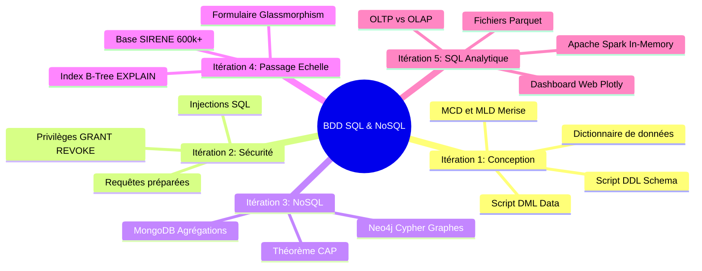

# 🗂️ VAULT OBSIDIAN MASTER — INDEX GÉNÉRAL DES 5 ITÉRATIONS

> [!INFO] **Bienvenue dans le Vault Obsidian BDD SQL & NoSQL**
> **Module** : BDD SQL DEVAA 2028 (Jours 1 à 5)  
> **Apprenant** : Bernard SOURICHANH (Campus Numérique)  
> **Ce fichier est la note principale du Vault Obsidian.**

---

## 🗺️ CARTE MENTALE DU VAULT (ITÉRATIONS 1 À 5)

---

## 🚀 ACCÈS DIRECT AUX ITÉRATIONS DU VAULT

### 1️⃣ [[01_Iteration_1_Conception_et_Creation/PROJET_BDD_SQL_COMPLET|Itération 1 — Conception & Modélisation BDD]]
- [[01_Iteration_1_Conception_et_Creation/01_conventions_nommage|Conventions de Nommage]]
- [[01_Iteration_1_Conception_et_Creation/02_dictionnaire_donnees|Dictionnaire de Données]]
- [[01_Iteration_1_Conception_et_Creation/03_mcd_mld|MCD et MLD Merise]]
- [[01_Iteration_1_Conception_et_Creation/04_schema_creation.sql|Script DDL Création]]
- [[01_Iteration_1_Conception_et_Creation/05_insertion_donnees.sql|Script DML Insertion]]

### 2️⃣ [[02_Iteration_2_Securisation_et_Privileges/VULNERABILITES_ET_SECURITE_SQL|Itération 2 — Sécurité & Privilèges SQL]]
- [[02_Iteration_2_Securisation_et_Privileges/06_memo_securite_sql|Synthèse des Failles SQL]]
- [[02_Iteration_2_Securisation_et_Privileges/07_patch_securite.sql|Patch Privilèges GRANT/REVOKE]]

### 3️⃣ [[03_Iteration_3_NoSQL/PROJET_NOSQL_COMPLET|Itération 3 — Introduction au NoSQL]]
- [[03_Iteration_3_NoSQL/01_memo_cap_theorem|Mémo Théorème CAP]]
- [[03_Iteration_3_NoSQL/02_mongodb_requetes.js|Requêtes MongoDB]]
- [[03_Iteration_3_NoSQL/03_neo4j_cypher.cypher|Requêtes Cypher Neo4j]]

### 4️⃣ [[04_Iteration_4_Passage_a_l_Echelle/PROJET_BDD_SQL_PASSAGE_ECHELLE|Itération 4 — Base SIRENE & Performance]]
- [[04_Iteration_4_Passage_a_l_Echelle/01_memo_index_et_types|Mémo Index B-Tree & EXPLAIN]]
- [[04_Iteration_4_Passage_a_l_Echelle/formulaire_recherche_sirene/app.py|Application Web Search Form]]

### 5️⃣ [[05_Iteration_5_SQL_Analytique_et_Spark/PROJET_NOSQL_ET_ANALYTIQUE_COMPLET|Itération 5 — SQL Analytique, Apache Spark & Parquet]] ⭐
- [[05_Iteration_5_SQL_Analytique_et_Spark/01_memo_oltp_vs_olap_spark|Mémo Théorique OLTP vs OLAP & MapReduce]]
- [[05_Iteration_5_SQL_Analytique_et_Spark/SOURICHANH-Bernard-Campus-Atelier2-ExplicationPerformance|Livrable Ex 4 — Performance MySQL vs Spark]]
- [[05_Iteration_5_SQL_Analytique_et_Spark/SOURICHANH-Bernard-Campus-Atelier2-BaseReduite.py|Livrable Ex 1 — Script Base Réduite Parquet/CSV]]
- [[05_Iteration_5_SQL_Analytique_et_Spark/SOURICHANH-Bernard-Campus-Atelier2-ComptagesAnalytiques.sql|Livrable Ex 2, 3, 5 — Requêtes SQL d'Agrégation]]
- [[05_Iteration_5_SQL_Analytique_et_Spark/SOURICHANH-Bernard-Campus-Atelier2-DashboardSpark.py|Livrable Ex 6 — Dashboard Decisionnel Web In-Memory]] (Accès Web : `http://localhost:8090`)

---

## 📋 RECAPITULATIF DES LIVRABLES CAMPUS (ATELIER 1 & ATELIER 2)

| Atelier | Fichier Livrable | Description |
| :--- | :--- | :--- |
| **Atelier 1** | `SOURICHANH-Bernard-Campus-Atelier1-BaseSIRENE.sql` | Importation et création de la BDD SIRENE |
| **Atelier 1** | `SOURICHANH-Bernard-Campus-Atelier1-Entreprises74.sql` | Extraction des établissements du 74 |
| **Atelier 1** | `SOURICHANH-Bernard-Campus-Atelier1-IndexesInutiles.sql` | Suppression des index B-Tree superflus |
| **Atelier 1** | `SOURICHANH-Bernard-Campus-Atelier1-OptimisationTypes.sql` | Optimisation des types SQL |
| **Atelier 2** | `SOURICHANH-Bernard-Campus-Atelier2-BaseReduite.py` | Generation de la base réduite analytique |
| **Atelier 2** | `SOURICHANH-Bernard-Campus-Atelier2-ComptagesAnalytiques.sql` | Requêtes SQL d'agrégation Top/Flop 10 |
| **Atelier 2** | `SOURICHANH-Bernard-Campus-Atelier2-ExplicationPerformance.md` | Mémo explicatif MySQL vs Spark |
| **Atelier 2** | `SOURICHANH-Bernard-Campus-Atelier2-DashboardSpark.py` | Serveur Dashboard Decisionnel Web |
