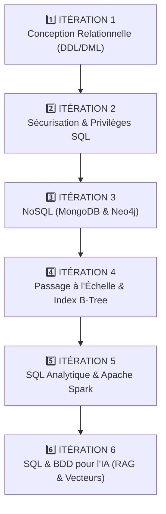

# 🧠 INDEX GLOBAL DU VAULT OBSIDIAN — BDD SQL, NOSQL, SPARK & VECTOR SEARCH

Bienvenue dans le Vault Obsidian du cours **BDD SQL / DEVAA2028**.
Ce Vault regroupe l'ensemble des cours, synthèses d'ingénierie, schémas relationnels, scripts d'analyse Spark et moteurs de recherche vectoriels RAG sur les 6 itérations de la formation.

---

## 📌 Sommaire des 6 Itérations du Projet

---

## 📂 Organisation par Itération

### 1️⃣ [01_Iteration_1_Conception_et_Creation](file:///home/user/Documents/Obsidian_Vault/01_Cours/BDD_SQL/01_Iteration_1_Conception_et_Creation/)
- `00_COMPRENDRE_ITERATION_1.md` : Modélisation conceptuelle (MCD / MLD), Formes Normales (3NF), DDL/DML.
- `SOURICHANH-Bernard-Campus-Atelier2-DictionnaireDonnees.md` : Dictionnaire de données complet.

### 2️⃣ [02_Iteration_2_Securisation_et_Privileges](file:///home/user/Documents/Obsidian_Vault/01_Cours/BDD_SQL/02_Iteration_2_Securisation_et_Privileges/)
- `00_COMPRENDRE_ITERATION_2.md` : Protection contre l'Injection SQL (`' OR '1'='1`), requêtes paramétrées, privilèges `GRANT/REVOKE`.

### 3️⃣ [03_Iteration_3_NoSQL](file:///home/user/Documents/Obsidian_Vault/01_Cours/BDD_SQL/03_Iteration_3_NoSQL/)
- `00_COMPRENDRE_ITERATION_3.md` : Théorème CAP (Consistency, Availability, Partition Tolerance).
- `EXPLICATION_ETAPES_NOSQL.md` : Agrégations MongoDB (`$match`, `$group`) & Graphes Neo4j Cypher.

### 4️⃣ [04_Iteration_4_Passage_a_l_Echelle](file:///home/user/Documents/Obsidian_Vault/01_Cours/BDD_SQL/04_Iteration_4_Passage_a_l_Echelle/)
- `00_COMPRENDRE_ITERATION_4.md` : Indexation B-Tree, comparaison Full Table Scan vs Index Scan (Gain **x115.9**).

### 5️⃣ [05_Iteration_5_SQL_Analytique_et_Spark](file:///home/user/Documents/Obsidian_Vault/01_Cours/BDD_SQL/05_Iteration_5_SQL_Analytique_et_Spark/)
- `00_COMPRENDRE_ITERATION_5.md` : Architecture OLTP vs OLAP, Apache Spark In-Memory, Parquet & Dashboard Web.
- `SOURICHANH-Bernard-Campus-Atelier2-ExplicationPerformance.md` : Synthèse de performance analytique.

### 6️⃣ [06_Iteration_6_SQL_et_IA_Vectorielle](file:///home/user/Documents/Obsidian_Vault/01_Cours/BDD_SQL/06_Iteration_6_SQL_et_IA_Vectorielle/)
- `00_COMPRENDRE_ITERATION_6.md` : RAG (Retrieval Augmented Generation), Bases Vectorielles (MariaDB 11 VECTOR / PgVector / ChromaDB).
- `SOURICHANH-Bernard-Campus-Atelier2-RAG_ExplicationVectorielle.md` : Synthèse théorique sur les Embeddings 384d et le comparatif mémoire RAM vs Disque.

---

## 🛠️ Master Execution & Dashboard Web
- **Command de validation globale** : `python3 tester_tout_le_projet.py`
- **Lancement Docker Web** : `sudo docker compose up -d` (Accès sur `http://localhost:8090`)
