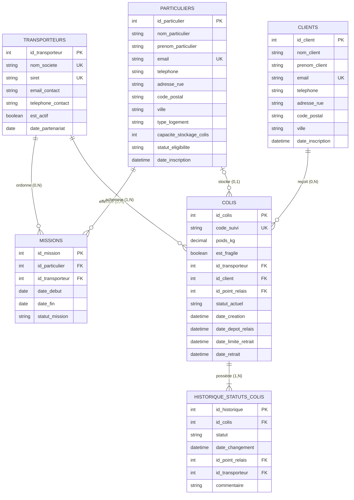

# 📐 03 — Modèle Conceptuel de Données (MCD) & Modèle Logique de Données (MLD) [Optimisé]

> [!NOTE]
> Ce document présente la modélisation conceptuelle (Entités - Associations - Cardinalités) et sa traduction sous forme de modèle logique relationnel (MLD) selon la méthode Merise, **mise à jour et harmonisée avec le dictionnaire de données optimisé**.

---

## 1. Modèle Conceptuel de Données (MCD)

### 🧩 Entités & Leurs Attributs Réels

1. **PARTICULIER (Point Relais à Domicile)** :
   - `id_particulier` (PK)
   - `nom_particulier`, `prenom_particulier`
   - `email`, `telephone`
   - `adresse_rue`, `adresse_complement`, `code_postal`, `ville`
   - `type_logement` (`Maison` / `Appartement`)
   - `capacite_stockage_colis` (Nombre max de colis)
   - `disponibilites_description` (Horaires d'ouverture)
   - `statut_eligibilite` (`EN_ATTENTE`, `ACTIF`, `INACTIF`, `SUSPENDU`)
   - `date_inscription`

2. **TRANSPORTEUR (Entreprise Logistique Partenaire)** :
   - `id_transporteur` (PK)
   - `nom_societe`, `siret` (14 chiffres)
   - `email_contact`, `telephone_contact`
   - `est_actif` (Booléen)
   - `date_partenariat`

3. **CLIENT (Destinataire Final)** :
   - `id_client` (PK)
   - `nom_client`, `prenom_client`
   - `email`, `telephone`
   - `adresse_rue`, `code_postal`, `ville`
   - `date_inscription`

4. **COLIS (Élément Central du Système)** :
   - `id_colis` (PK)
   - `code_suivi` (Unique, ex: `COL-2026-001`)
   - `poids_kg`, `longueur_cm`, `largeur_cm`, `hauteur_cm`
   - `est_fragile` (Booléen)
   - `statut_actuel` (`EN_COURS_LIVRAISON`, `AU_POINT_RELAIS`, `RETIRE`, `NON_RECLAME`, `EN_RETOUR_TRANSPORTEUR`, `LIVRAISON_TERMINEE`)
   - `date_creation`
   - `date_depot_relais` (Renseigné au dépôt)
   - `date_limite_retrait` (Calculé : Dépôt + 14 jours)
   - `date_retrait` (Renseigné lors de la récupération effective)

5. **HISTORIQUE_STATUTS_COLIS (Journal de Traçabilité)** :
   - `id_historique` (PK)
   - `statut` (Statut atteint lors de l'événement)
   - `date_changement` (Horodatage précis)
   - `commentaire` (Motif ou remarque)

---

### 🔗 Associations & Cardinalités Merise

- **AFFECTER (Mission Point Relais <-> Transporteur)** :
  - Un **PARTICULIER** peut effectuer `0,N` missions avec des transporteurs.
  - Un **TRANSPORTEUR** peut confier `0,N` missions à des particuliers.
  - *Attributs d'association* : `date_debut`, `date_fin`, `statut_mission`.
  - *Cardinalité* : `(0,N) <-> (0,N)` $\rightarrow$ Devient la table d'association `missions`.

- **ACHEMINER (Transporteur -> Colis)** :
  - Un **TRANSPORTEUR** achemine `1,N` colis.
  - Un **COLIS** est acheminé par `1,1` transporteur.
  - *Cardinalité* : `(1,N) <-> (1,1)` $\rightarrow$ `id_transporteur` (FK) migre dans **COLIS**.

- **DESTINER (Client -> Colis)** :
  - Un **CLIENT** est destinataire de `0,N` colis.
  - Un **COLIS** est destiné à `1,1` client.
  - *Cardinalité* : `(0,N) <-> (1,1)` $\rightarrow$ `id_client` (FK) migre dans **COLIS**.

- **STOCKER (Point Relais -> Colis)** :
  - Un **PARTICULIER** (Point Relais) peut héberger `0,N` colis simultanément.
  - Un **COLIS** est conservé dans `0,1` point relais à un instant $T$ (`NULL` si en cours de livraison).
  - *Cardinalité* : `(0,N) <-> (0,1)` $\rightarrow$ `id_point_relais` (FK nullable) migre dans **COLIS**.

- **HISTORISER (Traçabilité Colis)** :
  - Un **COLIS** possède `1,N` lignes d'historique de statut.
  - Une ligne d'**HISTORIQUE** concerne `1,1` et un seul colis.
  - *Cardinalité* : `(1,N) <-> (1,1)` $\rightarrow$ `id_colis` (FK) migre dans **HISTORIQUE_STATUTS_COLIS**.

---

### 📊 Diagramme Relationnel Entité-Association (Mermaid ER)

---

## 2. Modèle Logique de Données (MLD)

En appliquant les règles de passage du MCD au MLD :

- **`particuliers`** (
    <u>id_particulier</u>, nom_particulier, prenom_particulier, email, telephone, adresse_rue, adresse_complement, code_postal, ville, type_logement, capacite_stockage_colis, disponibilites_description, statut_eligibilite, date_inscription
)

- **`transporteurs`** (
    <u>id_transporteur</u>, nom_societe, siret, email_contact, telephone_contact, est_actif, date_partenariat
)

- **`clients`** (
    <u>id_client</u>, nom_client, prenom_client, email, telephone, adresse_rue, code_postal, ville, date_inscription
)

- **`missions`** (
    <u>id_mission</u>, #id_particulier, #id_transporteur, date_debut, date_fin, statut_mission
)

- **`colis`** (
    <u>id_colis</u>, code_suivi, poids_kg, longueur_cm, largeur_cm, hauteur_cm, est_fragile, #id_transporteur, #id_client, #id_point_relais, statut_actuel, date_creation, date_depot_relais, date_limite_retrait, date_retrait
)

- **`historique_statuts_colis`** (
    <u>id_historique</u>, #id_colis, statut, date_changement, #id_point_relais, #id_transporteur, commentaire
)

> **Légende** : <u>Souligné</u> = Clé Primaire (PK), `#` = Clé Étrangère (FK).
