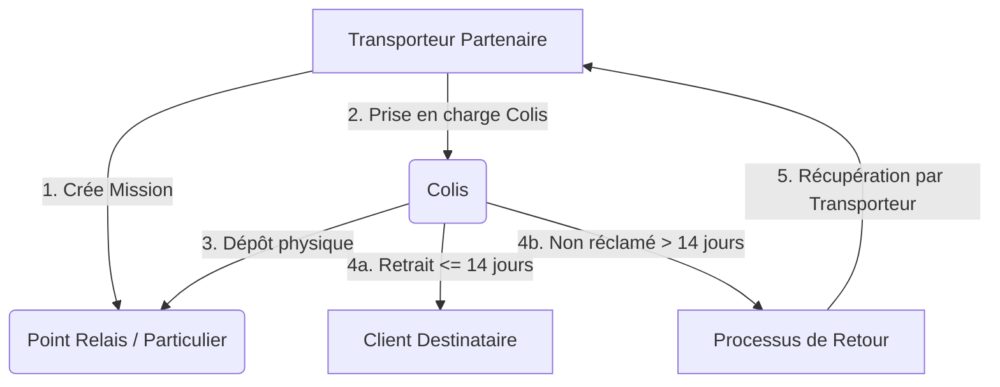

# 📦 Dossier de Conception & Implémentation — BDD SQL Colis Relais

> [!INFO] **Informations Générales**
> **Projet** : Conception, Création et Sécurisation de la Base de Données Relationale (Points Relais & Colis)
> **Formation** : BDD SQL DEVAA2028
> **Auteur** : Binôme Projet SQL
> **Version** : Complete (Itération 1 & Itération 2)

---

## 📂 Index des Documents du Dossier

Ce dossier rassemble l'ensemble des éléments de conception, de modélisation et de code SQL requis pour la livraison du projet :

1. 📜 [01 — Conventions de Nommage](file:///home/user/Documents/Cours/BDD_SQL/dossier_conception/01_conventions_nommage.md)
   *Normes de nommage des tables, champs, types, clés et contraintes d'intégrité.*

2. 📖 [02 — Dictionnaire de Données](file:///home/user/Documents/Cours/BDD_SQL/dossier_conception/02_dictionnaire_donnees.md)
   *Liste exhaustive de toutes les données du système, leurs types, tailles et contraintes métier.*

3. 📐 [03 — Modèle Conceptuel (MCD) & Logique (MLD)](file:///home/user/Documents/Cours/BDD_SQL/dossier_conception/03_mcd_mld.md)
   *Schéma Entité-Association, cardinalités Merise, diagramme Mermaid et MLD relationnel.*

4. 🗄️ [04 — Script SQL de Création DDL](file:///home/user/Documents/Cours/BDD_SQL/dossier_conception/04_schema_creation.sql)
   *Script SQL de création de la BDD `bdd_colis_relais` ordonné par niveaux de dépendances.*

5. 📥 [05 — Script SQL de Remplissage DML](file:///home/user/Documents/Cours/BDD_SQL/dossier_conception/05_insertion_donnees.sql)
   *Jeux de données de test couvrant l'ensemble des cas d'utilisation et statuts du cycle de vie.*

6. 🛡️ [06 — Mémo de Sécurité SQL (Itération 2)](file:///home/user/Documents/Cours/BDD_SQL/dossier_conception/06_memo_securite_sql.md)
   *Guide de prévention des vulnérabilités (Injections SQL, PreparedStatement, Hashage).*

---

## 🎯 Synthèse Métier & Architecture

### Table Synthétique des Livrables

| Livrable | Statut | Fichier Source |
| :--- | :--- | :--- |
| **Conventions de nommage** | ✅ Complété | [01_conventions_nommage.md](file:///home/user/Documents/Cours/BDD_SQL/dossier_conception/01_conventions_nommage.md) |
| **Dictionnaire de données** | ✅ Complété | [02_dictionnaire_donnees.md](file:///home/user/Documents/Cours/BDD_SQL/dossier_conception/02_dictionnaire_donnees.md) |
| **MCD & MLD Merise** | ✅ Complété | [03_mcd_mld.md](file:///home/user/Documents/Cours/BDD_SQL/dossier_conception/03_mcd_mld.md) |
| **Script DDL (Tables & Contraintes)** | ✅ Complété | [04_schema_creation.sql](file:///home/user/Documents/Cours/BDD_SQL/dossier_conception/04_schema_creation.sql) |
| **Script DML (Données de test)** | ✅ Complété | [05_insertion_donnees.sql](file:///home/user/Documents/Cours/BDD_SQL/dossier_conception/05_insertion_donnees.sql) |
| **Mémo de Sécurité SQL** | ✅ Complété | [06_memo_securite_sql.md](file:///home/user/Documents/Cours/BDD_SQL/dossier_conception/06_memo_securite_sql.md) |
