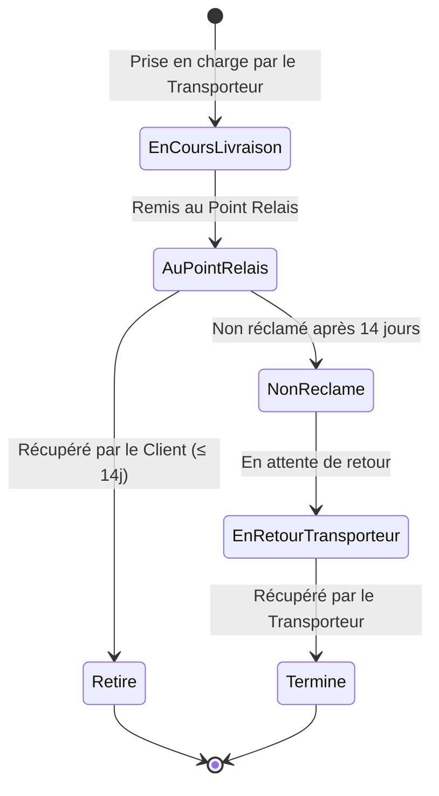
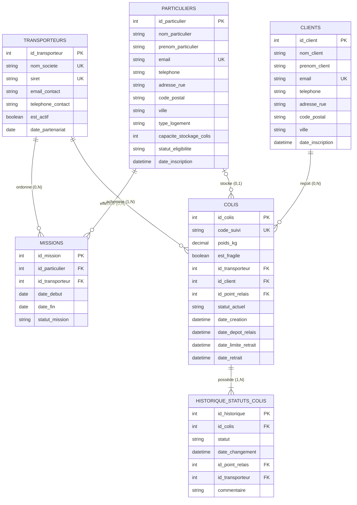

# 📦 Projet BDD SQL — Dossier Complet (Itérations 1 & 2 Optimisé)

> [!INFO] **Informations Générales**
> **Projet** : BDD SQL DEVAA2028 — Jour 2&3 : Projet SQL - Conception et Création
> **Sujet** : Gestion de la livraison de colis via des points relais à domicile
> **Contexte** : Une entreprise souhaite mettre en place une plateforme permettant à des particuliers de proposer leur domicile comme point relais, en collaboration avec des transporteurs partenaires et à destination de clients finaux.

---

## 📑 Sommaire des Étapes Moodle

- [Itération 1 : Conception & Création BDD](#itération-1--conception--création-de-la-base-de-données)
  - [1.1 | Cahier des charges](#11--cahier-des-charges)
  - [1.2 | Préparation & Conventions](#12--préparation)
  - [1.3 | Dictionnaire de données](#13--dictionnaire)
  - [1.4 | Modèle conceptuel de données (MCD)](#14--modèle-conceptuel-de-données-mcd)
  - [1.5 | Modèle logique de données (MLD)](#15--modèle-logique-de-données-mld)
  - [1.6 | Script création base de données & Remplissage](#16--script-création-base-de-données)
- [Itération 2 : Sécurisation (Optionnel / Avancé)](#itération-2--sécurisation)
  - [2.1 | Vulnérabilités SQL](#21--vulnérabilités-sql)
  - [2.2 | Mise en place des correctifs](#22--mise-en-place)

---

# ITÉRATION 1 : Conception & Création de la Base de Données

## 1.1 | Cahier des charges

### 🎯 Objectif
Concevoir une base de données à partir d'un cahier des charges de gestion de livraison de colis en points relais.

### 👥 Acteurs du Système
1. **Particuliers (Points Relais)** : Inscription, identité, adresse, contact, logement, disponibilités. Statut d'éligibilité (`EN_ATTENTE`, `ACTIF`, `INACTIF`, `SUSPENDU`).
2. **Transporteurs Partenaires** : S'appuient sur les points relais pour effectuer la livraison du dernier kilomètre via des **missions** définies dans le temps.
3. **Clients Destinataires** : Destinataires des colis qui viennent les récupérer au point relais.
4. **Interface d'Administration Interne** : Suivi global des points relais, transporteurs, missions et colis (retraits en attente, retours, colis récupérés).

### 🔄 Cycle de Vie d'un Colis


---

## 1.2 | Préparation

### 🎯 Objectif
Fixer les règles de fonctionnement et les conventions de nommage avant de démarrer la conception.

### 📐 Conventions de Nommage Adoptées
- **Casse** : `snake_case` en minuscules avec tiret du bas `_`.
- **Nom des Tables** : Noms communs au **pluriel** (`particuliers`, `transporteurs`, `clients`, `missions`, `colis`, `historique_statuts_colis`).
- **Clés Primaires (PK)** : `id_<nom_table_singulier>` (ex: `id_particulier`, `id_colis`).
- **Clés Étrangères (FK)** : `id_<nom_table_cible_singulier>` (ex: `id_transporteur`).
- **Champs Horodatés** : Préfixés par `date_` (ex: `date_inscription`, `date_depot_relais`).
- **Booléens** : Préfixés par `est_` (ex: `est_actif`, `est_fragile`).

---

## 1.3 | Dictionnaire

### 🎯 Objectif
Répertorier de manière exhaustive l'ensemble des données à sauvegarder.

| Table | Code Mnémonique | Désignation / Description | Type SQL | Taille | Contraintes & Règle de Gestion |
| :--- | :--- | :--- | :--- | :--- | :--- |
| `particuliers` | `id_particulier` | Identifiant du particulier | `INT` | AUTO | **PK**, Clé primaire auto-générée |
| | `nom_particulier` | Nom de famille | `VARCHAR` | 50 | NOT NULL |
| | `prenom_particulier`| Prénom | `VARCHAR` | 50 | NOT NULL |
| | `email` | Email de contact | `VARCHAR` | 100 | NOT NULL, UNIQUE, connexion |
| | `telephone` | Numéro de téléphone | `VARCHAR` | 20 | NOT NULL |
| | `adresse_rue` | Adresse du logement | `VARCHAR` | 255 | NOT NULL |
| | `adresse_complement` | Complément d'adresse | `VARCHAR` | 100 | NULLable |
| | `code_postal` | Code postal | `VARCHAR` | 10 | NOT NULL |
| | `ville` | Ville de résidence | `VARCHAR` | 100 | NOT NULL |
| | `type_logement` | Type de logement | `ENUM` | - | 'Maison', 'Appartement' |
| | `capacite_stockage_colis`| Nombre max de colis | `INT` | - | DEFAULT 5, CHECK (>0) |
| | `disponibilites_description`| Description horaires | `TEXT` | - | NULLable |
| | `statut_eligibilite`| État du point relais | `ENUM` | - | 'EN_ATTENTE', 'ACTIF', 'INACTIF', 'SUSPENDU' |
| | `date_inscription` | Date de création du compte | `DATETIME` | - | DEFAULT CURRENT_TIMESTAMP |
| `transporteurs`| `id_transporteur` | Identifiant du transporteur | `INT` | AUTO | **PK**, Clé primaire |
| | `nom_societe` | Raison sociale | `VARCHAR` | 100 | NOT NULL, UNIQUE |
| | `siret` | Numéro SIRET (14 car.) | `VARCHAR` | 14 | NOT NULL, UNIQUE, CHECK (14 car.) |
| | `email_contact` | Email logistique | `VARCHAR` | 100 | NOT NULL |
| | `telephone_contact` | Téléphone contact | `VARCHAR` | 20 | NOT NULL |
| | `est_actif` | Partenariat actif | `BOOLEAN` | - | DEFAULT TRUE |
| | `date_partenariat` | Date début partenariat | `DATE` | - | NOT NULL |
| `clients` | `id_client` | Identifiant du client | `INT` | AUTO | **PK**, Clé primaire |
| | `nom_client` | Nom de famille | `VARCHAR` | 50 | NOT NULL |
| | `prenom_client` | Prénom | `VARCHAR` | 50 | NOT NULL |
| | `email` | Email du destinataire | `VARCHAR` | 100 | NOT NULL, UNIQUE |
| | `telephone` | Téléphone destinataire | `VARCHAR` | 20 | NOT NULL |
| | `adresse_rue` | Adresse de livraison | `VARCHAR` | 255 | NOT NULL |
| | `code_postal` | Code postal | `VARCHAR` | 10 | NOT NULL |
| | `ville` | Ville | `VARCHAR` | 100 | NOT NULL |
| | `date_inscription` | Date inscription client | `DATETIME` | - | DEFAULT CURRENT_TIMESTAMP |
| `missions` | `id_mission` | Identifiant de la mission | `INT` | AUTO | **PK**, Clé primaire |
| | `id_particulier` | Relais concerné | `INT` | - | **FK** -> `particuliers(id_particulier)` |
| | `id_transporteur` | Transporteur concerné | `INT` | - | **FK** -> `transporteurs(id_transporteur)` |
| | `date_debut` | Date de début | `DATE` | - | NOT NULL |
| | `date_fin` | Date de fin | `DATE` | - | NULLable, CHECK (>= date_debut) |
| | `statut_mission` | État de la mission | `ENUM` | - | 'EN_COURS', 'TERMINEE', 'SUSPENDUE' |
| `colis` | `id_colis` | Identifiant du colis | `INT` | AUTO | **PK**, Clé primaire |
| | `code_suivi` | Code de suivi unique | `VARCHAR` | 50 | NOT NULL, UNIQUE |
| | `poids_kg` | Poids en kg | `DECIMAL` | 5,2 | NOT NULL, CHECK (>0) |
| | `longueur_cm` | Longueur en cm | `INT` | - | NULLable |
| | `largeur_cm` | Largeur en cm | `INT` | - | NULLable |
| | `hauteur_cm` | Hauteur en cm | `INT` | - | NULLable |
| | `est_fragile` | Indicateur fragilité | `BOOLEAN` | - | DEFAULT FALSE |
| | `id_transporteur` | Transporteur responsable | `INT` | - | **FK** -> `transporteurs(id_transporteur)` |
| | `id_client` | Client destinataire | `INT` | - | **FK** -> `clients(id_client)` |
| | `id_point_relais` | Point relais actuel | `INT` | - | **FK** -> `particuliers` (NULLable) |
| | `statut_actuel` | État courant dans le cycle | `ENUM` | - | 'EN_COURS_LIVRAISON', 'AU_POINT_RELAIS', 'RETIRE', 'NON_RECLAME', 'EN_RETOUR_TRANSPORTEUR', 'LIVRAISON_TERMINEE' |
| | `date_creation` | Date enregistrement | `DATETIME` | - | DEFAULT CURRENT_TIMESTAMP |
| | `date_depot_relais` | Date dépôt physique | `DATETIME` | - | NULLable |
| | `date_limite_retrait`| Date limite de retrait (14j) | `DATETIME` | - | NULLable, Règle des 14 jours |
| | `date_retrait` | Date retrait/récupération | `DATETIME` | - | NULLable |
| `historique_statuts_colis` | `id_historique` | Identifiant de la ligne | `INT` | AUTO | **PK**, Clé primaire |
| | `id_colis` | Colis tracé | `INT` | - | **FK** -> `colis(id_colis)` |
| | `statut` | Statut à cet instant | `ENUM` | - | Statuts colis |
| | `date_changement` | Horodatage de l'événement | `DATETIME` | - | DEFAULT CURRENT_TIMESTAMP |
| | `id_point_relais` | Point relais concerné | `INT` | - | **FK** -> `particuliers` (NULLable) |
| | `id_transporteur` | Transporteur concerné | `INT` | - | **FK** -> `transporteurs` (NULLable) |
| | `commentaire` | Remarque ou motif | `VARCHAR` | 255 | NULLable |

---

## 1.4 | Modèle conceptuel de données (MCD)



---

## 1.5 | Modèle logique de données (MLD)

- **`particuliers`** (<u>id_particulier</u>, nom_particulier, prenom_particulier, email, telephone, adresse_rue, adresse_complement, code_postal, ville, type_logement, capacite_stockage_colis, disponibilites_description, statut_eligibilite, date_inscription)
- **`transporteurs`** (<u>id_transporteur</u>, nom_societe, siret, email_contact, telephone_contact, est_actif, date_partenariat)
- **`clients`** (<u>id_client</u>, nom_client, prenom_client, email, telephone, adresse_rue, code_postal, ville, date_inscription)
- **`missions`** (<u>id_mission</u>, #id_particulier, #id_transporteur, date_debut, date_fin, statut_mission)
- **`colis`** (<u>id_colis</u>, code_suivi, poids_kg, longueur_cm, largeur_cm, hauteur_cm, est_fragile, #id_transporteur, #id_client, #id_point_relais, statut_actuel, date_creation, date_depot_relais, date_limite_retrait, date_retrait)
- **`historique_statuts_colis`** (<u>id_historique</u>, #id_colis, statut, date_changement, #id_point_relais, #id_transporteur, commentaire)

---

## 1.6 | Script création base de données

### 1.6.1 | Classification par Niveau de Dépendance
- **Niveau 0 (Aucune clé étrangère)** : `transporteurs`, `clients`, `particuliers`.
- **Niveau 1 (Lié au Niveau 0)** : `missions`.
- **Niveau 2 (Lié aux Niveaux 0 & 1)** : `colis`.
- **Niveau 3 (Traçabilité & Historique)** : `historique_statuts_colis`.

### 1.6.2 & 1.6.3 | Script DDL de Création (`04_schema_creation.sql`)

```sql
-- =============================================================================
-- SCRIPT DE CRÉATION DE LA BASE DE DONNÉES : bdd_colis_relais (DDL)
-- =============================================================================

CREATE DATABASE IF NOT EXISTS bdd_colis_relais
  DEFAULT CHARACTER SET utf8mb4
  DEFAULT COLLATE utf8mb4_unicode_ci;

USE bdd_colis_relais;

DROP TABLE IF EXISTS historique_statuts_colis;
DROP TABLE IF EXISTS colis;
DROP TABLE IF EXISTS missions;
DROP TABLE IF EXISTS particuliers;
DROP TABLE IF EXISTS clients;
DROP TABLE IF EXISTS transporteurs;

-- NIVEAU 0
CREATE TABLE transporteurs (
    id_transporteur INT AUTO_INCREMENT PRIMARY KEY,
    nom_societe VARCHAR(100) NOT NULL UNIQUE,
    siret VARCHAR(14) NOT NULL UNIQUE,
    email_contact VARCHAR(100) NOT NULL,
    telephone_contact VARCHAR(20) NOT NULL,
    est_actif BOOLEAN NOT NULL DEFAULT TRUE,
    date_partenariat DATE NOT NULL,
    CONSTRAINT chk_siret_length CHECK (CHAR_LENGTH(siret) = 14)
) ENGINE=InnoDB DEFAULT CHARSET=utf8mb4 COLLATE=utf8mb4_unicode_ci;

CREATE TABLE clients (
    id_client INT AUTO_INCREMENT PRIMARY KEY,
    nom_client VARCHAR(50) NOT NULL,
    prenom_client VARCHAR(50) NOT NULL,
    email VARCHAR(100) NOT NULL UNIQUE,
    telephone VARCHAR(20) NOT NULL,
    adresse_rue VARCHAR(255) NOT NULL,
    code_postal VARCHAR(10) NOT NULL,
    ville VARCHAR(100) NOT NULL,
    date_inscription DATETIME NOT NULL DEFAULT CURRENT_TIMESTAMP
) ENGINE=InnoDB DEFAULT CHARSET=utf8mb4 COLLATE=utf8mb4_unicode_ci;

CREATE TABLE particuliers (
    id_particulier INT AUTO_INCREMENT PRIMARY KEY,
    nom_particulier VARCHAR(50) NOT NULL,
    prenom_particulier VARCHAR(50) NOT NULL,
    email VARCHAR(100) NOT NULL UNIQUE,
    telephone VARCHAR(20) NOT NULL,
    adresse_rue VARCHAR(255) NOT NULL,
    adresse_complement VARCHAR(100) DEFAULT NULL,
    code_postal VARCHAR(10) NOT NULL,
    ville VARCHAR(100) NOT NULL,
    type_logement ENUM('Maison', 'Appartement') NOT NULL,
    capacite_stockage_colis INT NOT NULL DEFAULT 5,
    disponibilites_description TEXT DEFAULT NULL,
    statut_eligibilite ENUM('EN_ATTENTE', 'ACTIF', 'INACTIF', 'SUSPENDU') NOT NULL DEFAULT 'EN_ATTENTE',
    date_inscription DATETIME NOT NULL DEFAULT CURRENT_TIMESTAMP,
    CONSTRAINT chk_capacite_positive CHECK (capacite_stockage_colis > 0)
) ENGINE=InnoDB DEFAULT CHARSET=utf8mb4 COLLATE=utf8mb4_unicode_ci;

-- NIVEAU 1
CREATE TABLE missions (
    id_mission INT AUTO_INCREMENT PRIMARY KEY,
    id_particulier INT NOT NULL,
    id_transporteur INT NOT NULL,
    date_debut DATE NOT NULL,
    date_fin DATE DEFAULT NULL,
    statut_mission ENUM('EN_COURS', 'TERMINEE', 'SUSPENDUE') NOT NULL DEFAULT 'EN_COURS',
    CONSTRAINT fk_missions_particulier FOREIGN KEY (id_particulier) 
        REFERENCES particuliers(id_particulier) ON DELETE RESTRICT ON UPDATE CASCADE,
    CONSTRAINT fk_missions_transporteur FOREIGN KEY (id_transporteur) 
        REFERENCES transporteurs(id_transporteur) ON DELETE RESTRICT ON UPDATE CASCADE,
    CONSTRAINT chk_dates_mission CHECK (date_fin IS NULL OR date_fin >= date_debut)
) ENGINE=InnoDB DEFAULT CHARSET=utf8mb4 COLLATE=utf8mb4_unicode_ci;

-- NIVEAU 2
CREATE TABLE colis (
    id_colis INT AUTO_INCREMENT PRIMARY KEY,
    code_suivi VARCHAR(50) NOT NULL UNIQUE,
    poids_kg DECIMAL(5,2) NOT NULL,
    longueur_cm INT DEFAULT NULL,
    largeur_cm INT DEFAULT NULL,
    hauteur_cm INT DEFAULT NULL,
    est_fragile BOOLEAN NOT NULL DEFAULT FALSE,
    id_transporteur INT NOT NULL,
    id_client INT NOT NULL,
    id_point_relais INT DEFAULT NULL,
    statut_actuel ENUM(
        'EN_COURS_LIVRAISON', 
        'AU_POINT_RELAIS', 
        'RETIRE', 
        'NON_RECLAME', 
        'EN_RETOUR_TRANSPORTEUR', 
        'LIVRAISON_TERMINEE'
    ) NOT NULL DEFAULT 'EN_COURS_LIVRAISON',
    date_creation DATETIME NOT NULL DEFAULT CURRENT_TIMESTAMP,
    date_depot_relais DATETIME DEFAULT NULL,
    date_limite_retrait DATETIME DEFAULT NULL,
    date_retrait DATETIME DEFAULT NULL,
    CONSTRAINT fk_colis_transporteur FOREIGN KEY (id_transporteur) 
        REFERENCES transporteurs(id_transporteur) ON DELETE RESTRICT ON UPDATE CASCADE,
    CONSTRAINT fk_colis_client FOREIGN KEY (id_client) 
        REFERENCES clients(id_client) ON DELETE RESTRICT ON UPDATE CASCADE,
    CONSTRAINT fk_colis_point_relais FOREIGN KEY (id_point_relais) 
        REFERENCES particuliers(id_particulier) ON DELETE SET NULL ON UPDATE CASCADE,
    CONSTRAINT chk_poids_positif CHECK (poids_kg > 0)
) ENGINE=InnoDB DEFAULT CHARSET=utf8mb4 COLLATE=utf8mb4_unicode_ci;

-- NIVEAU 3
CREATE TABLE historique_statuts_colis (
    id_historique INT AUTO_INCREMENT PRIMARY KEY,
    id_colis INT NOT NULL,
    statut ENUM(
        'EN_COURS_LIVRAISON', 
        'AU_POINT_RELAIS', 
        'RETIRE', 
        'NON_RECLAME', 
        'EN_RETOUR_TRANSPORTEUR', 
        'LIVRAISON_TERMINEE'
    ) NOT NULL,
    date_changement DATETIME NOT NULL DEFAULT CURRENT_TIMESTAMP,
    id_point_relais INT DEFAULT NULL,
    id_transporteur INT DEFAULT NULL,
    commentaire VARCHAR(255) DEFAULT NULL,
    CONSTRAINT fk_historique_colis FOREIGN KEY (id_colis) 
        REFERENCES colis(id_colis) ON DELETE CASCADE ON UPDATE CASCADE,
    CONSTRAINT fk_historique_point_relais FOREIGN KEY (id_point_relais) 
        REFERENCES particuliers(id_particulier) ON DELETE SET NULL ON UPDATE CASCADE,
    CONSTRAINT fk_historique_transporteur FOREIGN KEY (id_transporteur) 
        REFERENCES transporteurs(id_transporteur) ON DELETE SET NULL ON UPDATE CASCADE
) ENGINE=InnoDB DEFAULT CHARSET=utf8mb4 COLLATE=utf8mb4_unicode_ci;

-- INDEX POUR LES REQUÊTES FRÉQUENTES
CREATE INDEX idx_colis_statut ON colis(statut_actuel);
CREATE INDEX idx_colis_point_relais ON colis(id_point_relais);
CREATE INDEX idx_colis_code_suivi ON colis(code_suivi);
CREATE INDEX idx_particuliers_ville ON particuliers(ville, code_postal);
CREATE INDEX idx_historique_colis_date ON historique_statuts_colis(id_colis, date_changement);
```

### 1.6.4 | Script DML de Remplissage (`05_insertion_donnees.sql`)

```sql
-- =============================================================================
-- SCRIPT DE REMPLISSAGE (DML) : bdd_colis_relais
-- =============================================================================

USE bdd_colis_relais;

-- 1. TRANSPORTEURS
INSERT INTO transporteurs (id_transporteur, nom_societe, siret, email_contact, telephone_contact, est_actif, date_partenariat) VALUES
(1, 'DHL Express France', '12345678901234', 'partenaires@dhl.fr', '0149754000', TRUE, '2025-01-10'),
(2, 'Chronopost', '98765432109876', 'relais@chronopost.fr', '0969391414', TRUE, '2025-02-01'),
(3, 'Mondial Relay', '45678912345678', 'reseau-particulier@mondialrelay.fr', '0969322332', TRUE, '2025-03-15');

-- 2. CLIENTS
INSERT INTO clients (id_client, nom_client, prenom_client, email, telephone, adresse_rue, code_postal, ville) VALUES
(1, 'Dupont', 'Jean', 'jean.dupont@email.fr', '0612345678', '12 Avenue des Fleurs', '75011', 'Paris'),
(2, 'Curie', 'Marie', 'marie.curie@email.fr', '0698765432', '5 Rue de la Paix', '34000', 'Montpellier'),
(3, 'Martin', 'Thomas', 'thomas.martin@email.fr', '0755443322', '88 Boulevard Victor Hugo', '69002', 'Lyon'),
(4, 'Bernard', 'Sophie', 'sophie.bernard@email.fr', '0633221100', '3 Impasse des Lilas', '31000', 'Toulouse');

-- 3. PARTICULIERS (POINTS RELAIS)
INSERT INTO particuliers (id_particulier, nom_particulier, prenom_particulier, email, telephone, adresse_rue, adresse_complement, code_postal, ville, type_logement, capacite_stockage_colis, disponibilites_description, statut_eligibilite, date_inscription) VALUES
(1, 'Lefebvre', 'Antoine', 'antoine.relais@email.fr', '0622334455', '14 Rue de la République', 'Bâtiment A, RDC', '75011', 'Paris', 'Appartement', 8, 'Du Lundi au Vendredi de 17h30 à 20h00, Samedi toute la journée', 'ACTIF', '2025-01-15 10:00:00'),
(2, 'Moreau', 'Camille', 'camille.relais@email.fr', '0677889900', '27 Chemin du Moulin', NULL, '34000', 'Montpellier', 'Maison', 15, 'Mardi au Samedi de 14h00 à 19h00', 'ACTIF', '2025-02-20 14:30:00'),
(3, 'Petit', 'Lucas', 'lucas.petit@email.fr', '0644556677', '9 Rue de la Gare', 'Apt 42', '69002', 'Lyon', 'Appartement', 4, 'Lundi, Mercredi, Vendredi de 18h00 à 21h00', 'EN_ATTENTE', '2025-07-01 09:15:00'),
(4, 'Dubois', 'Elodie', 'elodie.dubois@email.fr', '0611223344', '50 Rue Saint-Rome', NULL, '31000', 'Toulouse', 'Maison', 10, 'Disponible 7j/7 sur rendez-vous', 'SUSPENDU', '2025-03-10 11:20:00');

-- 4. MISSIONS
INSERT INTO missions (id_mission, id_particulier, id_transporteur, date_debut, date_fin, statut_mission) VALUES
(1, 1, 1, '2025-02-01', '2026-12-31', 'EN_COURS'),
(2, 1, 2, '2025-03-01', '2026-12-31', 'EN_COURS'),
(3, 2, 2, '2025-03-01', '2026-12-31', 'EN_COURS'),
(4, 2, 3, '2025-04-01', '2026-12-31', 'EN_COURS');

-- 5. COLIS (Couverture complète des Use Cases)
INSERT INTO colis (id_colis, code_suivi, poids_kg, longueur_cm, largeur_cm, hauteur_cm, est_fragile, id_transporteur, id_client, id_point_relais, statut_actuel, date_creation, date_depot_relais, date_limite_retrait, date_retrait) VALUES
(1, 'COL-2026-001', 1.50, 20, 15, 10, FALSE, 1, 1, NULL, 'EN_COURS_LIVRAISON', '2026-08-03 08:00:00', NULL, NULL, NULL),
(2, 'COL-2026-002', 3.20, 30, 20, 15, TRUE, 2, 2, 2, 'AU_POINT_RELAIS', '2026-08-01 10:00:00', '2026-08-01 16:30:00', '2026-08-15 16:30:00', NULL),
(3, 'COL-2026-003', 0.80, 15, 10, 5, FALSE, 1, 1, 1, 'RETIRE', '2026-07-20 09:00:00', '2026-07-21 14:00:00', '2026-08-04 14:00:00', '2026-07-23 18:45:00'),
(4, 'COL-2026-004', 5.00, 40, 30, 25, FALSE, 2, 3, 2, 'NON_RECLAME', '2026-07-14 11:00:00', '2026-07-15 15:00:00', '2026-07-29 15:00:00', NULL),
(5, 'COL-2026-005', 2.10, 25, 20, 10, TRUE, 3, 4, 2, 'EN_RETOUR_TRANSPORTEUR', '2026-07-10 09:30:00', '2026-07-11 17:00:00', '2026-07-25 17:00:00', NULL),
(6, 'COL-2026-006', 4.50, 35, 25, 20, FALSE, 2, 1, 1, 'LIVRAISON_TERMINEE', '2026-07-01 08:00:00', '2026-07-02 14:00:00', '2026-07-16 14:00:00', '2026-07-19 11:30:00');

-- 6. HISTORIQUE STATUTS
INSERT INTO historique_statuts_colis (id_colis, statut, date_changement, id_point_relais, id_transporteur, commentaire) VALUES
(1, 'EN_COURS_LIVRAISON', '2026-08-03 08:00:00', NULL, 1, 'Prise en charge par le hub DHL'),
(2, 'EN_COURS_LIVRAISON', '2026-08-01 10:00:00', NULL, 2, 'Prise en charge Chronopost'),
(2, 'AU_POINT_RELAIS', '2026-08-01 16:30:00', 2, 2, 'Déposé chez Camille Moreau. Client notifié.'),
(3, 'EN_COURS_LIVRAISON', '2026-07-20 09:00:00', NULL, 1, 'Prise en charge DHL'),
(3, 'AU_POINT_RELAIS', '2026-07-21 14:00:00', 1, 1, 'Déposé chez Antoine Lefebvre'),
(3, 'RETIRE', '2026-07-23 18:45:00', 1, NULL, 'Remis à Jean Dupont sur présentation d une pièce d identité'),
(4, 'EN_COURS_LIVRAISON', '2026-07-14 11:00:00', NULL, 2, 'En transit'),
(4, 'AU_POINT_RELAIS', '2026-07-15 15:00:00', 2, 2, 'Déposé au point relais'),
(4, 'NON_RECLAME', '2026-07-30 00:00:00', 2, NULL, 'Passage automatique en non réclamé : délai de 14j expiré'),
(5, 'EN_COURS_LIVRAISON', '2026-07-10 09:30:00', NULL, 3, 'En transit Mondial Relay'),
(5, 'AU_POINT_RELAIS', '2026-07-11 17:00:00', 2, 3, 'Déposé chez Camille Moreau'),
(5, 'NON_RECLAME', '2026-07-26 00:00:00', 2, NULL, 'Délai de 14j dépassé'),
(5, 'EN_RETOUR_TRANSPORTEUR', '2026-07-27 10:00:00', 2, 3, 'Étiquette de retour générée. En attente du chauffeur Mondial Relay.'),
(6, 'EN_COURS_LIVRAISON', '2026-07-01 08:00:00', NULL, 2, 'En transit'),
(6, 'AU_POINT_RELAIS', '2026-07-02 14:00:00', 1, 2, 'Déposé chez Antoine Lefebvre'),
(6, 'NON_RECLAME', '2026-07-17 00:00:00', 1, NULL, 'Non réclamé par le destinataire'),
(6, 'EN_RETOUR_TRANSPORTEUR', '2026-07-18 09:00:00', 1, 2, 'Demande de retour enregistrée'),
(6, 'LIVRAISON_TERMINEE', '2026-07-19 11:30:00', 1, 2, 'Colis récupéré par le chauffeur Chronopost. Processus clôturé.');
```

---

# ITÉRATION 2 : Sécurisation

## 2.1 | Vulnérabilités SQL

### 🎯 Objectif
Identifier les risques de sécurité (Injections SQL, stockage non sécurisé) et rédiger un mémo de protection.

---

## 2.2 | Mise en place

### 🎯 Objectif
Securiser l'application Java/PHP et le serveur de base de données.

### 🛡️ Mesures Appliquées
1. **Utilisation systématique de `PreparedStatement`** (Requêtes paramétrées) :
   ```java
   String sql = "SELECT * FROM colis WHERE code_suivi = ? AND statut_actuel = ?";
   PreparedStatement pstmt = connection.prepareStatement(sql);
   pstmt.setString(1, codeSuiviInput);
   pstmt.setString(2, "AU_POINT_RELAIS");
   ResultSet rs = pstmt.executeQuery();
   ```
2. **Hashage des Mots de Passe avec BCrypt** :
   ```java
   String hash = BCrypt.hashpw(rawPassword, BCrypt.gensalt(12));
   ```
3. **Variables d'Environnement (`.env`)** :
   Stockage des mots de passe BDD hors de Git.

---

## 📦 Livrables Validés

- [x] **1.1 | Cahier des charges & Use Cases**
- [x] **1.2 | Conventions de nommage**
- [x] **1.3 | Dictionnaire de données**
- [x] **1.4 | MCD (Modèle Conceptuel de Données)**
- [x] **1.5 | MLD (Modèle Logique de Données)**
- [x] **1.6 | Script SQL de création (DDL) et de remplissage (DML)**
- [x] **2.1 | Mémo des failles de sécurité SQL**
- [x] **2.2 | Protection du code (`PreparedStatement`) et des accès (`.env`)**
