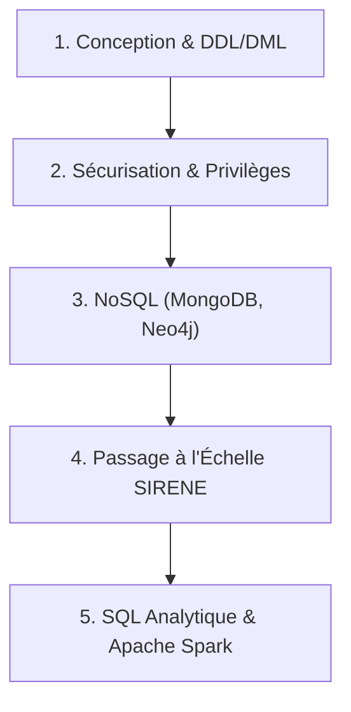

# 📦 Projet BDD SQL — Guide Obsidian & Synthèse des 5 Itérations

> [!INFO] **Contexte du Projet**
> **Module** : BDD SQL DEVAA 2028 (Jour 1, 2, 3, 4 et 5)
> **Sujet** : Conception BDD, Sécurisation, NoSQL, Passage à l'Échelle SIRENE (600k+ établissements) et SQL Analytique (OLAP / Apache Spark).

---

## 🗂️ Vue d'ensemble des 5 Itérations du Vault

---

## 🛠️ ITÉRATION 1 : Conception & Création de la Base de Données

### 📍 Documents & Scripts
- 📄 `01_conventions_nommage.md` — Règle de nommage `snake_case`, PK/FK.
- 📋 `02_dictionnaire_donnees.md` — Dictionnaire exhaustif des entités et contraintes.
- 📐 `03_mcd_mld.md` — Schémas Merise MCD et MLD.
- 🗄️ `04_schema_creation.sql` — Script DDL de création (6 tables).
- 📥 `05_insertion_donnees.sql` — Script DML d'insertion des jeux de test.
- 🧪 `test_bdd.py` — Valideur automatisé de cohérence des clés primaires/étrangères.

---

## 🔐 ITÉRATION 2 : Sécurisation & Privilèges SQL

### 📍 Documents & Scripts
- 📜 `06_memo_securite_sql.md` — Guide d'analyse des failles SQL Injection.
- 🛡️ `07_patch_securite.sql` — Script d'attribution des privilèges MySQL (`GRANT`, `REVOKE`).
- 🔒 `VULNERABILITES_ET_SECURITE_SQL.md` — Mémo sur les requêtes préparées (`PreparedStatement`) et le hachage BCrypt.

---

## 🍃 ITÉRATION 3 : Introduction au NoSQL

### 📍 Documents & Scripts
- 📊 `01_memo_cap_theorem.md` — Théorème CAP (Consistency, Availability, Partition Tolerance).
- 🍃 `02_mongodb_requetes.js` — Requêtes d'agrégation et filtres MongoDB (Collection `mflix/movies`).
- 🕸️ `03_neo4j_cypher.cypher` — Requêtes en graphe Cypher Neo4j (Nœuds & Relations).
- 🎮 `04_quiz_game_java_nosql.md` — Application Java Quiz Terminal interactive.

---

## ⚡ ITÉRATION 4 : SQL & Passage à l'Échelle (Base SIRENE 600k+)

### 📍 Documents & Scripts
- ⚡ `01_memo_index_et_types.md` — Analyse d'exécution `EXPLAIN ANALYZE` et index B-Tree.
- 🔍 `02_exercice1_indexes_sirene.sql` & `04_exercice3_nettoyage_indexes.sql` — Optimisation des index B-Tree.
- 🏢 `03_exercice2_entreprises_74.sql` — Extraction des établissements de Haute-Savoie (74).
- ⚙️ `05_exercice4_optimisation_types.sql` — Optimisation de la mémoire (`VARCHAR` -> `CHAR`, `INT`, `ENUM`).
- 🌐 `formulaire_recherche_sirene/` — Formulaire Web Glassmorphism & API SQL Python sans limitation 50 (`app.py`, `index.html`).

---

## 🚀 ITÉRATION 5 : SQL Analytique, Apache Spark & Parquet

### 📍 Documents & Scripts
- 📘 `01_memo_oltp_vs_olap_spark.md` — Mémo théorique comparant OLTP (Transactionnel) vs OLAP (Analytique), MapReduce et Apache Spark.
- 📂 `SOURICHANH-Bernard-Campus-Atelier2-BaseReduite.py` — Script Exercice 1 générant la base analytique réduite par commune (`716 Ko` au lieu de 10 Go).
- 📜 `SOURICHANH-Bernard-Campus-Atelier2-ComptagesAnalytiques.sql` — Requêtes SQL d'agrégation Exercices 2, 3 et 5 (Comptage par commune, département, Top 10 et Flop 10).
- 📝 `SOURICHANH-Bernard-Campus-Atelier2-ExplicationPerformance.md` — Livrable Exercice 4 comparant MySQL vs Apache Spark In-Memory.
- 🌐 `SOURICHANH-Bernard-Campus-Atelier2-DashboardSpark.py` & `static/index.html` — Application Web Decisionnelle Exercice 6 avec Carte de chaleur Plotly.js sur **`http://localhost:8090`**.

---

## 📋 Checklist Globale des Livrables du Vault

- [x] **Itération 1** : Dossier de Conception, Dictionnaire de données, MCD/MLD, DDL & DML.
- [x] **Itération 2** : Patch de sécurité SQL, Privilèges restreints et prévention des injections SQL.
- [x] **Itération 3** : Théorème CAP, Requêtes MongoDB, Graphes Cypher Neo4j & Quiz Java.
- [x] **Itération 4** : Importation SIRENE 600k+, Optimisation des Types & Index SQL, Formulaire Web Glassmorphism.
- [x] **Itération 5** : Base réduite Parquet/CSV, Requêtes OLAP (`GROUP BY`), Comparatif MySQL vs Spark, Dashboard Web décisionnel Plotly.js.
