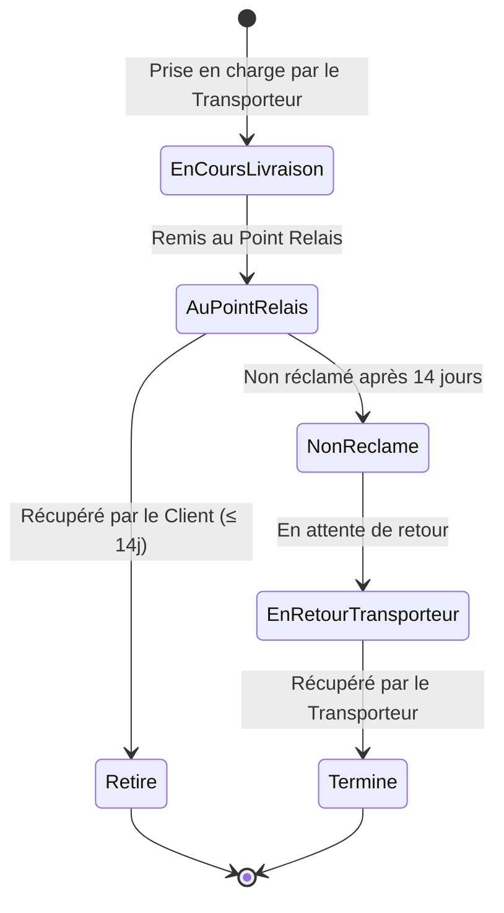

# 📦 Projet BDD SQL — Guide d'Exécution & Étapes du Projet

> [!INFO] **Contexte du Projet**
> **Sujet** : Plateforme de gestion de livraison de colis via des points relais à domicile (particuliers), en collaboration avec des transporteurs partenaires et à destination des clients finaux.
> **Objectif principal** : Concevoir, structurer, implémenter et sécuriser une base de données relationnelle répondant aux exigences du cahier des charges.

---

## 🎯 Vue d'ensemble du Cahier des Charges & Use Cases

### 👥 Acteurs du Système
1. **Particuliers (Points Relais)** : Inscription, profil (identité, adresse, contact, logement, disponibilités). Statut actif/inactif selon leur éligibilité vis-à-vis des transporteurs.
2. **Transporteurs Partenaires** : S'appuient sur les points relais pour effectuer la livraison du dernier kilomètre via des **missions** définies dans le temps.
3. **Clients Destinataires** : Destinataires des colis qui viennent les récupérer au point relais.
4. **Administrateurs (Interface Interne)** : Suivi et gestion globale des points relais, transporteurs, missions et état des colis.

### 🔄 Cycle de vie d'un Colis

---

## 🛠️ ITÉRATION 1 : Conception & Création de la Base de Données

### 📍 Étape 1.1 | Analyse du Cahier des Charges & Scénarios (~1h)
- [ ] Lire et analyser en binôme l'ensemble du cahier des charges.
- [ ] Identifier les données indispensables à garder en mémoire.
- [ ] Lister les scénarios / cas d'utilisation (*use cases*) que les utilisateurs et employés devront réaliser (ex: arrivée d'un colis, retrait client, retour transporteur, affectation d'une mission).
- [ ] Initialiser le document **Dossier de Conception**.

---

### 📍 Étape 1.2 | Préparation & Conventions de Nommage (~0.5h)
> [!TIP] **Fixer les règles avant la conception**
- [ ] Échanger et convenir des règles et conventions de nommage :
  - **Nom des tables** : `snake_case` au pluriel (ex: `points_relais`, `transporteurs`, `colis`).
  - **Nom des données / colonnes** : `snake_case` au singulier (ex: `code_postal`, `date_livraison`).
  - **Clés primaires** : `id_<table_singulier>` (ex: `id_colis`, `id_point_relais`).
  - **Clés étrangères** : `id_<table_cible_singulier>` (ex: `id_transporteur`).
  - **Types de données** : Notation standardisée (`VARCHAR`, `INT`, `DATETIME`, etc.).
- [ ] Choisir l'outil de modélisation (ex: **AnalyseSI**, **Looping**, **MCD2SQL**, etc.).
- [ ] Rédiger et ajouter ces conventions dans le **Dossier de Conception**.

---

### 📍 Étape 1.3 | Dictionnaire de Données (~1h)
- [ ] Créer le tableau du dictionnaire de données dans le dossier de conception (doit contenir à minima : Code mnémonique, Désignation, Type, Taille) :
  | Code Mnémonique | Désignation | Type SQL / Logique | Taille | Contraintes & Remarques |
  | :--- | :--- | :--- | :--- | :--- |
  | `id_particulier` | Identifiant unique du particulier | INT / AUTO_INCREMENT | - | Clé Primaire |
  | `nom_particulier` | Nom de famille du particulier | VARCHAR | 50 | NOT NULL |
  | `prenom_particulier` | Prénom du particulier | VARCHAR | 50 | NOT NULL |
  | `adresse_particulier`| Adresse du logement | VARCHAR | 255 | NOT NULL |
  | `code_postal` | Code postal | VARCHAR | 10 | NOT NULL |
  | `ville` | Ville de résidence | VARCHAR | 100 | NOT NULL |
  | `statut_eligibilite`| Statut d'activation du point relais | VARCHAR / ENUM | 20 | ex: ACTIF, INACTIF |
  | `code_suivi_colis` | Numéro de suivi unique du colis | VARCHAR | 50 | UNIQUE, NOT NULL |
  | `statut_colis` | État actuel du colis | VARCHAR / ENUM | 30 | EN_COURS, AU_RELAIS, RETIRE, NON_RECLAME, RETOURNE |
  | `date_changement_statut` | Date du changement d'état | DATETIME | - | NOT NULL |
  | `id_transporteur` | Identifiant du transporteur | INT | - | Clé Étrangère |
  | ... | *(Compléter de manière exhaustive avec toutes les données)* | ... | ... | ... |

---

### 📍 Étape 1.4 | Modèle Conceptuel de Données - MCD (~7.5h)
- [ ] Regrouper les données du dictionnaire par **Entités** (Rectangles avec identifiant unique en premier).
- [ ] Relier les entités par des **Associations** en respectant la méthode Merise.
- [ ] Définir précisément les **Cardinalités** :
  - `0,1` : Lié à au plus une entité.
  - `1,1` : Lié à une et une seule entité.
  - `0,N` : Lié à zéro ou plusieurs entités.
  - `1,N` : Lié à au moins une entité.
- [ ] Principales associations à modéliser :
  - **Particulier <-> Mission <-> Transporteur** (période donnée).
  - **Colis <-> Transporteur / Point Relais / Client Final**.
  - **Colis <-> Historique des États** (traçabilité avec dates et intervenants).
- [ ] Vérifier que chaque donnée du dictionnaire est positionnée dans le MCD.
- [ ] Ajouter le schéma MCD complet au **Dossier de Conception**.

---

### 📍 Étape 1.5 | Modèle Logique de Données - MLD (~1h)
- [ ] Transformer les associations du MCD en tables et clés étrangères (MLD) :
  1. **Relation `(0,1/1,1)` <-> `(0,N/1,N)`** : La clé primaire du côté `N` est ajoutée comme **Clé Étrangère (FK)** dans la table du côté `1`.
  2. **Relation `(0,N/1,N)` <-> `(0,N/1,N)`** : Création d'une **Table d'Association** spécifique contenant les clés primaires des deux tables comme clés étrangères.
- [ ] Remplacer les associations par les flèches reliant clés étrangères (FK) vers clés primaires (PK).
- [ ] Vérifier le respect rigoureux des conventions de nommage.
- [ ] Intégrer le schéma MLD au **Dossier de Conception**.

---

### 📍 Étape 1.6 | Scripts SQL de Création & Remplissage (~3h)

#### 1. Rangement par Niveau de Dépendance
- [ ] Déterminer l'ordre d'exécution de création des tables :
  - **Niveau 0** : Aucune clé étrangère (ex: `transporteurs`, `clients`, `statuts`).
  - **Niveau 1** : Dépend d'au moins une table de Niveau 0 (ex: `particuliers`, `missions`).
  - **Niveau 2+** : Dépend de tables de Niveau 1 ou supérieur (ex: `colis`, `historique_statuts`).

#### 2. Script de Création DDL (`schema.sql` / `create_db.sql`)
- [ ] Écrire la création de la base de données (`CREATE DATABASE IF NOT EXISTS bdd_colis_relais;`).
- [ ] Écrire les requêtes `CREATE TABLE` dans l'ordre strict des niveaux.
- [ ] Définir les types, tailles, `PRIMARY KEY`, `FOREIGN KEY ... REFERENCES`, `NOT NULL`, et `CHECK`.
- [ ] Exécuter et tester le script sur votre serveur de base de données.
- [ ] Générer le schéma issu de la base et le comparer avec votre MLD.

#### 3. Script de Remplissage DML (`seeds.sql` / `insert_data.sql`)
- [ ] Insérer les jeux de données de référence (Transporteurs, types de statuts).
- [ ] Insérer les données demandées explicitement par le client.
- [ ] Insérer des jeux de données de test couvrant tous les scénarios (*use cases*) :
  - Particuliers avec des missions actives et inactives.
  - Colis en cours de livraison.
  - Colis stockés au point relais en attente de retrait.
  - Colis dépassés (14 jours dépassés -> à basculer en `NON_RECLAME`).
  - Colis en cours de retour vers le transporteur.
- [ ] Enregistrer les scripts dans le **Dossier de Conception**.

---

## 🔐 ITÉRATION 2 : Sécurisation (Failles SQL & Code Java)

### 📍 Étape 2.1 | Failles SQL & Rédaction du Mémo
- [ ] Rechercher les vulnérabilités courantes des BDD SQL avec Java :
  - **Injections SQL** (requêtes dynamiques construites par concaténation).
  - Stockage des données sensibles (mots de passe stockés en texte brut).
  - Fuites des paramètres d'accès BDD (identifiants codés en dur dans le code source).
- [ ] Rédiger un **Mémo de Sécurité** centralisant les bonnes pratiques :
  - Utilisation systématique de requêtes préparées (`PreparedStatement`).
  - Hashage sécurisé des mots de passe (`bcrypt`, `argon2`).
  - Fichier de configuration sécurisé / variables d'environnement (`.env`) hors de Git.

---

### 📍 Étape 2.2 | Implémentation des Correctifs
- [ ] Refactoriser le code Java pour utiliser des requêtes préparées (`PreparedStatement`).
- [ ] Tester le programme contre les injections SQL (ex: saisie de `' OR '1'='1`).
- [ ] Appliquer des patchs SQL si la structure de la BDD comporte une faille (ex: agrandir la colonne du mot de passe pour stocker le hash).
- [ ] Sécuriser le stockage des accès au serveur BDD.

---

## 📋 Checklist Globale des Livrables pour Obsidian

### 📑 Livrables Attendus
- [ ] **Dossier de Conception**
  - [ ] Conventions de nommage validées
  - [ ] Dictionnaire des données complet
  - [ ] MCD (Modèle Conceptuel de Données)
  - [ ] MLD (Modèle Logique de Données)
- [ ] **Scripts SQL**
  - [ ] Script de création de la BDD (`schema.sql`)
  - [ ] Script d'insertion des données de test (`seeds.sql`)
- [ ] **Sécurité (Itération 2)**
  - [ ] Mémo des failles de sécurité SQL
  - [ ] Code Java sécurisé (`PreparedStatement`)
  - [ ] Patch BDD et identifiants sécurisés (`.env`)

---

> [!SUCCESS] **Conseil de Validation**
> Avant de passer du MCD au MLD et d'écrire les scripts SQL, présentez votre dictionnaire de données et votre MCD à votre formateur (qui joue le rôle du représentant du client) pour valider vos choix !
