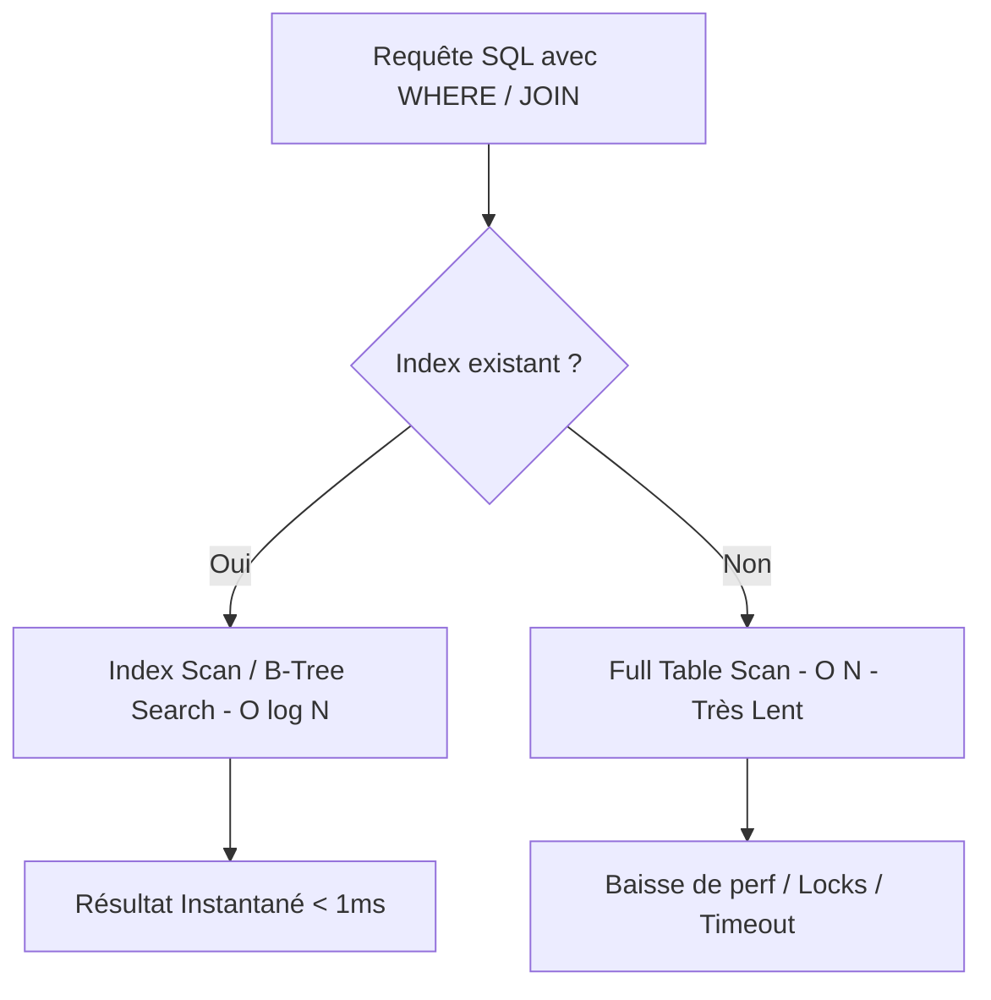

# ⚡ 01 — Mémo Théorique : Indexation, Types SQL et Passage à l'Échelle

> [!INFO] **Module BDD SQL — SQL et Passage à l'Échelle (7h)**
> **Sujet** : Optimisation des performances des bases de données relationnelles pour les fortes volumétries.
> **Objectifs** : Maîtriser le fonctionnement des index, choisir les types de données optimaux et savoir décrypter un plan d'exécution avec `EXPLAIN ANALYZE`.

---

## 1. Fonctionnement et Qualité des Index SQL

Un **index SQL** est une structure de données (généralement un arbre équilibré **B-Tree**) qui permet au moteur de recherche de trouver des lignes spécifiques sans parcourir la totalité de la table (*Full Table Scan*).



### 🔑 Emplacements Utiles pour les Index
- Colonnes dans les clauses **`WHERE`** et **`HAVING`**.
- Colonnes de jointure dans les clauses **`JOIN`** (`ON t1.fk = t2.pk`).
- Colonnes de tri et d'enchaînement : **`ORDER BY`** et **`GROUP BY`**.
- **Clés Étrangères (FK)** et **Clés Primaires (PK)** (automatique pour PK).

### ⚠️ Cardinalité et Inutilité de Certains Index
- **Cardinalité élevée** (Ex: `siret`, `email`, `code_suivi`) $\rightarrow$ **Index TRÈS Performant**.
- **Cardinalité faible** (Ex: `est_actif`, `sexe`, `statut` avec 2 ou 3 valeurs) $\rightarrow$ **Index INUTILE / INEFACE** (Le SGBD préfère un balayage de table).
- **Index Composite** (`WHERE colA = x AND colB = y`) $\rightarrow$ L'ordre des colonnes doit respecter le principe de la clé la plus sélective en premier.

---

## 2. Optimisation des Types de Données (Taille en Octets)

Chaque octet économisé sur une colonne multiplié par des millions de lignes réduit drastiquement l'empreinte RAM et disque !

### 📊 Comparatif des Types Entiers (MySQL)

| Type SQL | Taille (Octets) | Valeurs Signées | Valeurs Non Signées (`UNSIGNED`) | Usage Recommandé |
| :--- | :--- | :--- | :--- | :--- |
| `TINYINT` | **1 octet** | -128 à 127 | 0 à 255 | Mois, statuts, petits codes |
| `SMALLINT` | **2 octets** | -32 768 à 32 767 | 0 à 65 535 | Codes postaux, années, petits ID |
| `MEDIUMINT` | **3 octets** | -8 388 608 à 8 388 607 | 0 à 16 777 215 | Départements, prix en €, villes |
| `INT` | **4 octets** | -2 147 483 648 à +2,14 Milliards | 0 à 4,29 Milliards | Clés primaires standards |
| `BIGINT` | **8 octets** | -9×10¹⁸ à +9×10¹⁸ | 0 à 18×10¹⁸ | Logs Big Data, microsecondes |

### 🔤 Chaînes et Dates
- Préférer `VARCHAR(14)` à `VARCHAR(255)` pour un numéro SIRET.
- Préférer `CHAR(5)` pour un code postal de longueur fixe (évite l'octet d'en-tête dynamique).
- Utiliser `DATE` (3 octets) au lieu de `DATETIME` (5 octets) si l'heure n'est pas requise.

---

## 3. Analyse des Performances avec `EXPLAIN ANALYZE`

L'instruction `EXPLAIN ANALYZE` exécute la requête SQL et fournit le plan d'exécution détaillé du SGBD avec le temps réel passé à chaque étape :

```sql
EXPLAIN ANALYZE 
SELECT * FROM etablissements 
WHERE code_postal = '74000' AND code_activite = '6201Z';
```

### 🔍 Éléments Clés à Observer
- **`type`** :
  - `const` / `eq_ref` : **Parfait** (Accès direct par PK/Unique).
  - `ref` / `range` : **Très Bon** (Utilisation d'un index non-unique ou intervalle).
  - `ALL` : 🔴 **DANGER - Full Table Scan** (Aucun index utilisé !).
- **`rows`** : Nombre de lignes examinées par le moteur.
- **`filtered`** : Pourcentage de lignes conservées après filtrage.
- **`cost`** / **`actual time`** : Temps réel en millisecondes.
