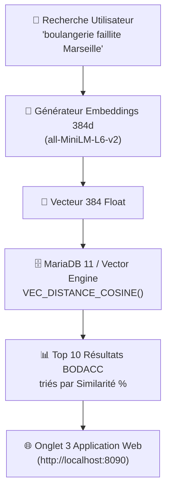

# 🧠 TOUT COMPRENDRE SUR L'ITÉRATION 6 — SQL, RAG & BDD VECTORIELLE 384D

Bienvenue dans le guide de compréhension intégrale de l'**Itération 6**. Ce document explique en termes simples et précis tout ce que cette itération apporte et comment fonctionne l'Intelligence Artificielle Vectorielle appliquée aux annonces judiciaires du BODACC.

---

## 🎯 1. Quel est l'objectif de l'Itération 6 ?

Dans les itérations précédentes (IT1 à IT5), nous avons manipulé du **SQL relationnel classique (B-Tree)** et du **SQL analytique (Spark OLAP)**. Cependant, la recherche par mots-clés SQL exacts a une limite majeure :
> *Si un utilisateur cherche "boulangerie en faillite", une BDD classique ne trouvera pas un jugement qui contient "MARIE BLACHERE - Redressement judiciaire pour cessation de paiements", car le mot exact "faillite" n'y figure pas !*

L'objectif de l'Itération 6 est de **résoudre ce problème grâce à l'IA Vectorielle et au RAG (Retrieval-Augmented Generation)**.

---

## 💡 2. Les 3 Concepts Majeurs à Maîtriser

### A. Embeddings Vectoriels (384 Dimensions)
- Un **Embedding** est la transformation d'un texte (une phrase, un jugement) en un **Vecteur de 384 nombres flottants** (modèle `all-MiniLM-L6-v2`).
- Exemple :
  `"Redressement judiciaire pour impayés"` ➔ `[0.041, -0.128, 0.089, ..., -0.034]`
- Ces 384 nombres capturent **le SENS et le CONTEXTE sémantique** du texte.

### B. Distance Cosinus (`VEC_DISTANCE_COSINE` dans MariaDB 11)
- Pour savoir si une recherche ressemble à une annonce BODACC, le système calcule l'angle entre les 2 vecteurs de 384 dimensions.
- Si la distance est proche de `0`, le sens est quasi-identique !
- Le score de similarité est ensuite converti en pourcentage (`94.8 %`).

### C. RAG (Retrieval-Augmented Generation)
- Le RAG consiste à utiliser cette base vectorielle pour retrouver les meilleures annonces légales correspondantes afin d'alimenter un modèle d'IA (LLM) sans hallucination.

---

## 🏗️ 3. Architecture Technique de l'Itération 6

---

## 📋 4. Livrable Officiel pour Moodle
Le fichier théorique à rendre sur Moodle pour cette itération est :
📄 **`SOURICHANH-Bernard-Campus-Atelier2-RAG_ExplicationVectorielle.md`**
